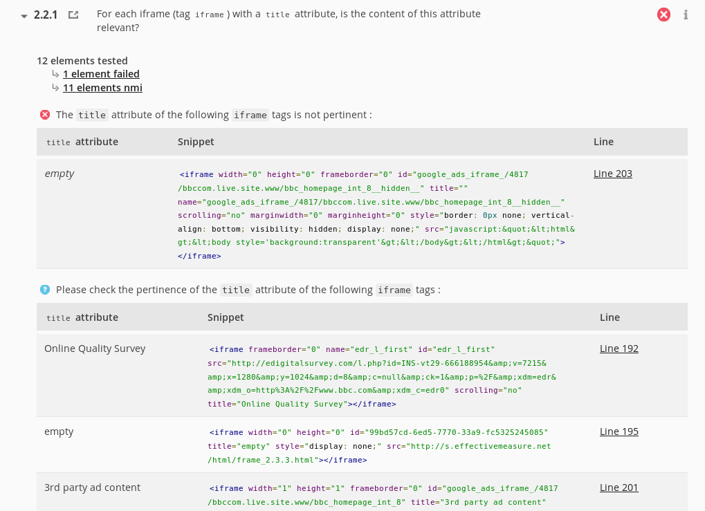
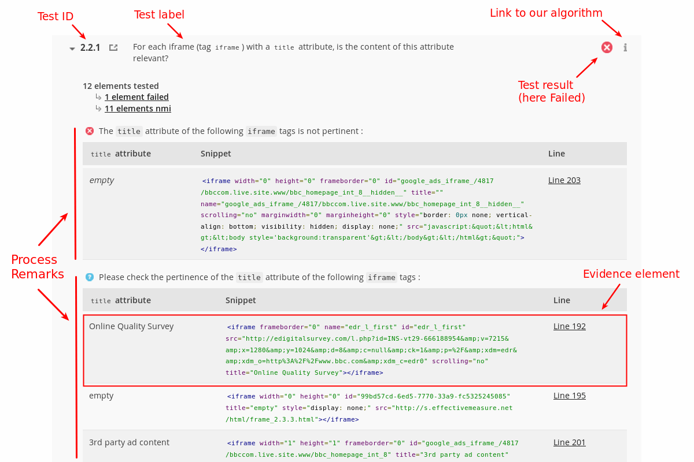

# Structure of a result

The result of a test looks like this:

## The basics

You can see on a first row:

* the test identifier
* the label of the test (its description, what it does)
* the icon showing the result of the test (you remember, one of Passed, Failed, Not Applicable, Pre Qualified or Not Tested)

## The counts

Then a section presents the counts:

* count of tested elements
* count of Failed elements
* count of Pre-Qualified elements

## Process remarks & Evidence elements

Following is what we call the *Process Remarks*: information associated to the result.
These information may be related to the Failed elements or to the Pre-Qualified elements, or both.

Each Process Remark may contain one or more *Evidence Element*: precise and detailed data 
on what deserves attention, why and where in the source code. The nature of thiss data may differ from
one test to another (e.g. images could be presented for the tests on images, and portions of
 code could be presented for tests on links). 

## Example

## Various cases of Process Remarks

Depending on the test and the HTML tested, you may encouter different combinations of Process Remarks.

@@@Screenshots of different kinds of Process Remarks organisations.

